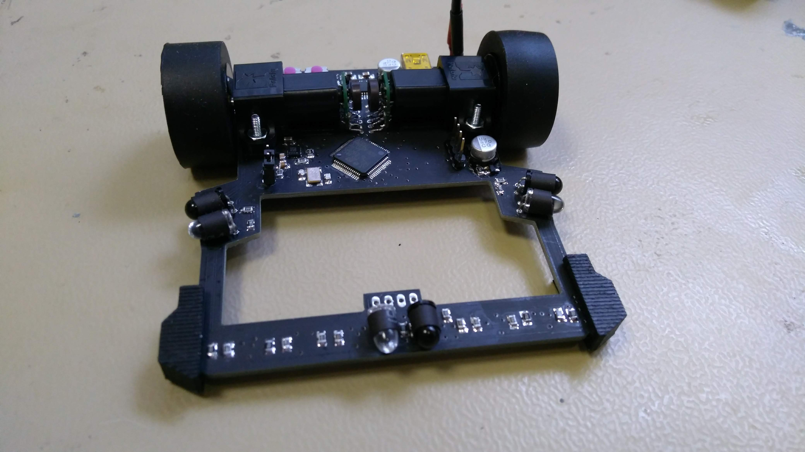
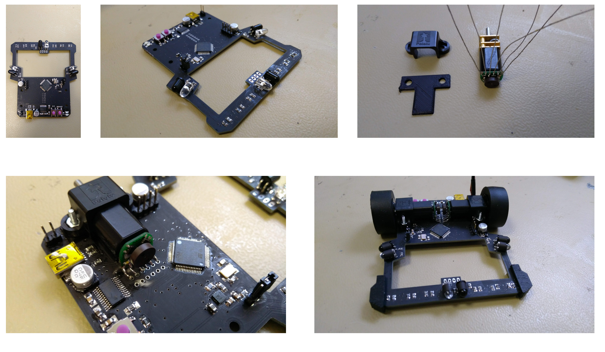
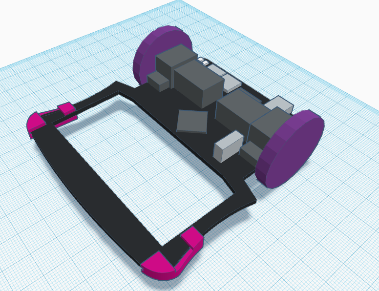
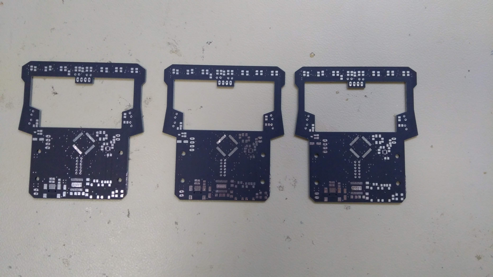
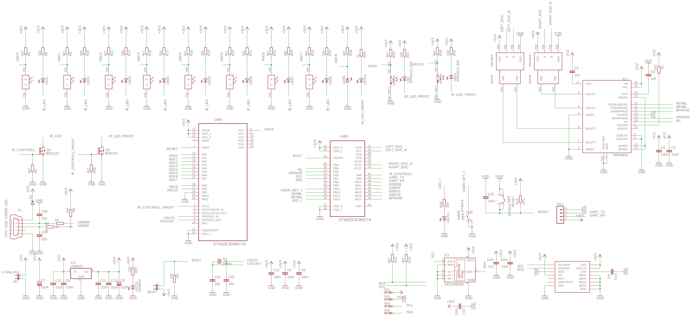
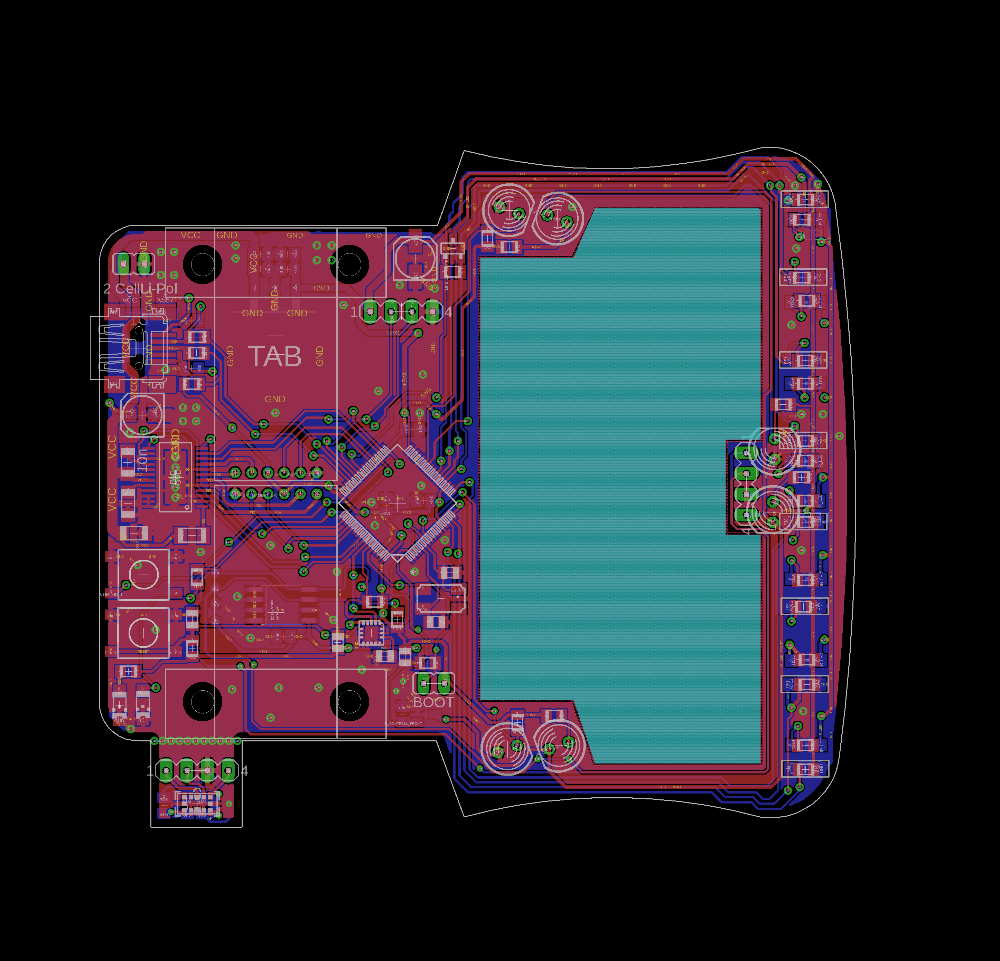
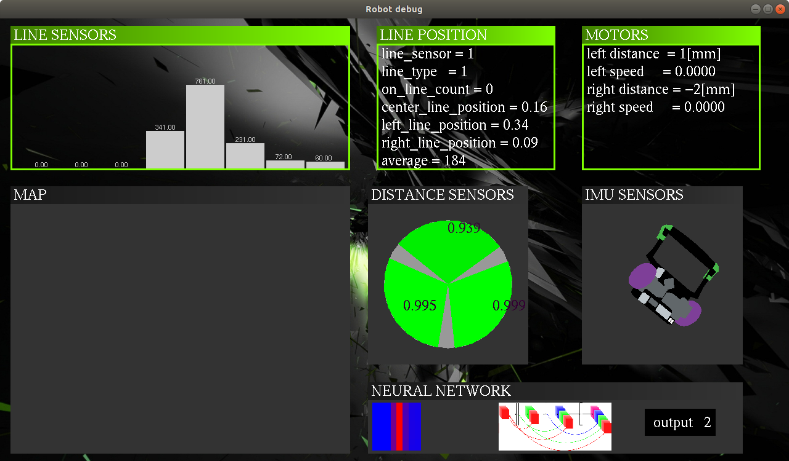
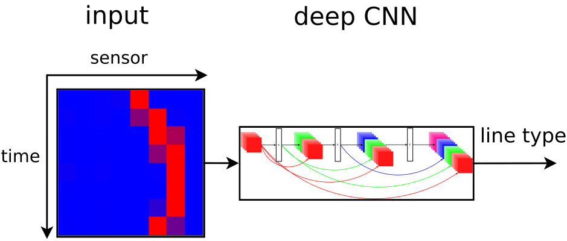
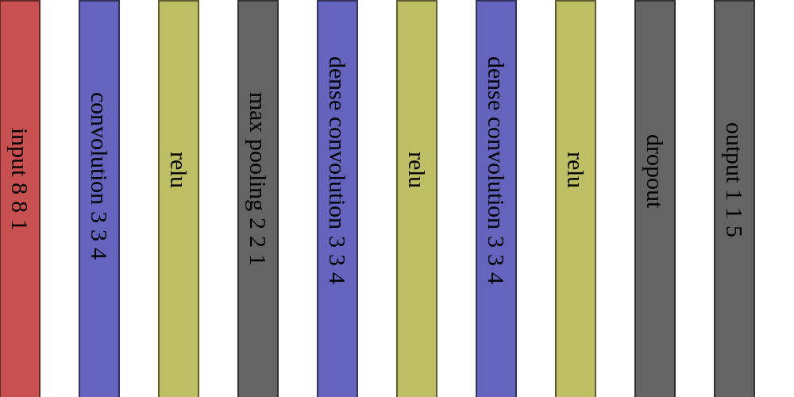

# Motoko Uprising
## line following robot with neural network predictor

Advanced line following robot, using custom deep neural network for curve shape prediction.
Robot can recognize straight line and speed up.

* Video1 of woking robot [motoko video 1](https://www.youtube.com/watch?v=E9FJIDowNmU)
* Video2 of woking robot [motoko video 2](https://www.youtube.com/watch?v=xUAJ1LA6Xwc)

### some photos of robot

###### Hardware

* CPU is ARM Cortex M4F, stm32f303, 73MHz
  * with simd instructions, good to have for deep learning
* gyroscope : lsm303 
  * (or something like THAT - yeah, they are changing it more often then socks)
* motors : pololu HP 1:30, micro metal gear, with magnetic encoders
* motor driver : TI DRV8834
* line sensors : phototransitors for visible light (not IR)
  * Iam using white leds, so the line can be colored - not only black
* obstacle detection :
  * common IR leds, and laser (still not working as I wish - too slow, but high range)
* accu : LiPol 2S, 150mAh, from dualsky

Some photos from mounting this devilry device :
* PCB design are in  [pcb](hardware/export), ready to send to your favorite manufactor
  * 
  * 
  * 
  * 
  
* Chassis, there are little of 3D printed parts [3d print](hardware/chassis)
  * 

###### Software

**Debug app**

TODO - this will be long journey

