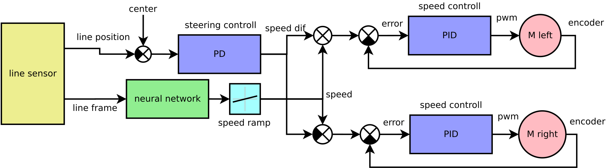

# Motoko Uprising
## line following robot with neural network predictor

Advanced line following robot, using custom deep neural network for curve shape prediction.
Robot can recognize straight line and speed up.

* Video1 of woking robot [motoko video 1](https://www.youtube.com/watch?v=E9FJIDowNmU)
* Video2 of woking robot [motoko video 2](https://www.youtube.com/watch?v=xUAJ1LA6Xwc)


## Hardware

* CPU is ARM Cortex M4F, stm32f303, 72MHz
  * with simd instructions, good to have for deep learning
* gyroscope : lsm303 
  * (or something like THAT - yeah, they are changing it more often then socks)
* motors : pololu HP 1:30, micro metal gear, with magnetic encoders
* motor driver : TI DRV8834
* line sensors : phototransitors for visible light (not IR)
  * Iam using white leds, so the line can be colored - not only black
* obstacle detection :
  * common IR leds, and laser (still not working as I wish - too slow, but high range)
* accu : LiPol 2S, 150mAh, from dualsky


Some photos from mounting this devilry device :
* PCB design are in  [pcb](hardware/export), ready to send to your favorite manufactor
  * 
  * 
  * 
  * 
  
* Chassis, there are little of 3D printed parts [3d print](hardware/chassis)
  * 


## Firmware





### PIDs

PIDs in differential form are used, with antiwindup

the controller equation is :
%20%3D%20u(n-1)%20%2B%20k_0e(n)%20%2B%20k_1e(n-1)%20%2B%20k_2e(n-2))

```cpp
float PID::process(float error, float plant_output)
{
    e1 = e0;
    e0 = error;

    x2 = x1;
    x1 = x0;
    x0 = plant_output;

    u+= k0*e0 + k1*e1 - kd*(x0 - 2*x1 + x2);

    if (u > limit)
      u = limit;

    if (u < -limit)
      u = -limit;

    return u;
}
```

motors controllers step response :


## Debug application


There is debug application written in Python. Data received from robot are visualised in custom GUI written
using OpenGL. Data are transfered in JSON format.

Robot GUI is also designed in json - to modify gui design, only this file need to be modified. Example of gui.json file format : 

```json
"widgets" :
  {
    "type"      : "label",
    "position"  : [0.0, 0.0, 0.0],
    "color"     : [1.0, 0.0, 0.0],
    "font_size" : 0.1,

    "widgets" : [
                  {
                    "type"           : "bar_graph",
                    "position"       : [-2.0, 1.25, 0.0],
                    "color"          : [0.5, 1.0, 0.0],
                    "bar_color"      : [0.8, 0.8, 0.8],

                    "font_size" : 0.05,

                    "width"     : 1.5,
                    "height"    : 0.5,

                    "filled"    : false,
                    "enlight_max_value" : false,

                    "frame_width" : 0.01,
                    "label"     : "LINE SENSORS",

                    "min_value" : 0.0,
                    "max_value" : 1024.0,

                    "variable"  : {
                                    "name"  : "line_sensors",
                                    "value" : [3, 40, 500, 1000, 700, 50, 0, 0]
                                  }
                  },
...
```


